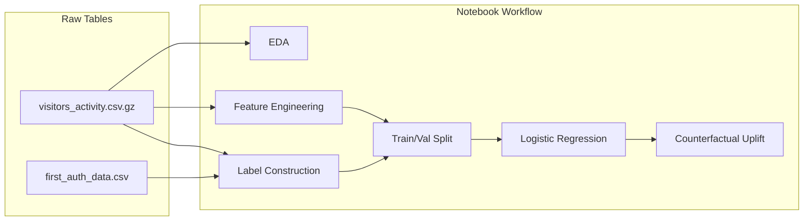

# TurboTax Homepage Experience — Implementation Plan

## Data clarification

The prompt defines **two raw tables** (already in `data/`):

| File | Role |
|------|------|
| `data/first_auth_data.csv` | First-time auth timestamps |
| `data/visitors_activity.csv.gz` | **Raw clickstream** — one row per event (`action`, `url`, `event_ts`, `experience_id`, etc.) |

`data/homepage_experience_data.csv` is **not** raw clickstream. It is a pre-aggregated, pre-featurized table produced by `build_model_dataset.py`. Since feature engineering is part of the exercise, we **remove this file and `build_model_dataset.py`** and rebuild everything from the two raw tables inside the notebook workflow.

**Decision unit (per session):** Each homepage impression where `experience_id` is populated (`action == "view_homepage"`, `screen == "homepage"`). In the synthetic data this is 8,000 rows — one experiment decision per visitor/session.



---

## Project layout

```
turbotax/
  data/
    first_auth_data.csv          # keep
    visitors_activity.csv.gz       # keep (raw clickstream)
  src/
    config.py                    # paths, constants, experience IDs
    data_loading.py              # load/parse raw tables
    eda.py                       # EDA helpers + plots
    labels.py                    # auth label at homepage decision point
    features.py                  # session-level feature engineering
    dataset.py                   # assemble decision-point rows
    modeling.py                  # LR train/predict
    uplift.py                    # counterfactual scoring + recommendations
    evaluation.py                # metrics + offline policy summary
  notebooks/
    homepage_experience_modeling.ipynb
  requirements.txt               # add jupyter, matplotlib, seaborn, scikit-learn
  generate_dataset.py            # keep (synthetic data only)
```

---

## Notebook structure

`notebooks/homepage_experience_modeling.ipynb` — clean orchestration only; heavy logic lives in `src/`.

### Section 0 — Overview (markdown)
Document upfront:
- **Problem framing:** Predict auth probability under each of 7 homepage experiences; recommend the experience with highest predicted auth rate; report uplift vs. the experience actually shown.
- **ML formulation:** Binary outcome (`authenticated`) with `experience_id` as a categorical treatment variable in a single logistic regression (`P(auth | X, experience)`).
- **Decision point:** Homepage impression within a session; features use only events in that session **before** the homepage timestamp (no leakage).
- **Assumptions:**
  - Conditional independence: experience assignment is ignorable given features (approx. true in synthetic data where ~85% of assignments are random; weak in real observational data).
  - Session features capture enough visitor intent for counterfactual extrapolation.
  - First auth after homepage view is the sole success metric (subsequent auths ignored).
- **Limitations:**
  - Only one experience observed per session (no ground-truth counterfactual outcomes).
  - Logistic regression may underfit cookie/URL interactions.
  - Offline uplift estimates are model-based, not causal.
  - URL featurization is intentionally shallow per prompt guidance.
- **Next steps (not implemented):** IPS/doubly-robust offline policy eval, T-learner/X-learner uplift models, gradient boosting, calibration plots, production A/B validation.

### Section 1 — Setup
- Imports, `%matplotlib inline`, load config paths, set random seed.
- Call `data_loading.load_tables()`.

### Section 2 — EDA
Use `src/eda.py` for reusable plots/stats; notebook shows key outputs only:
- Row counts, date range, visitors vs. auths, auth rate.
- Homepage experience distribution (`experience_id` 1–7).
- Auth rate by shown experience (observational baseline).
- Session/event depth: events per session, sessions per visitor before homepage.
- Cookie cardinality: unique cookie IDs, frequency distribution (motivate top-K encoding).
- URL/action/screen frequency tables (sanity checks).
- Time-of-day / day-of-week patterns at homepage.

### Section 3 — Label construction
`src/labels.py`:
- Parse `event_dt` from `event_ts` (UTC).
- Identify homepage decision rows: `experience_id.notna()` (or `action == "view_homepage"`).
- Truncate clickstream per visitor: drop events at or after `first_auth_dt` before EDA/features.
- Join `first_auth_data`; label `authenticated = 1` iff `first_auth_dt >= homepage_event_dt` **and** auth `visitor_session_id` matches the homepage session, else `0`.
- Output: `decision_df` keyed by `(visitor_identifier, visitor_session_id, homepage_event_ts)`.

### Section 4 — Feature engineering (per session)
`src/features.py` + `src/dataset.py`:

**Session-scoped features** (events in same `visitor_session_id` with `event_dt < homepage_dt`):
- Volume: `n_session_events`, `n_unique_urls`, `n_unique_actions`
- Action counts: `click_cta`, `play_video`, `scroll`, etc.
- URL category flags: contains `pricing`, `help`, `sign-in`, `business`, etc.
- Recency: `seconds_since_session_start`
- Time: `homepage_hour`, `homepage_dow`

**Visitor-scoped features** (all prior sessions before homepage):
- `n_prior_sessions`, `n_prior_events`, `hours_since_first_seen`

**Cookie features** (from `cookie_ids` JSON list on decision row):
- `n_cookies` (count)
- 15 compact cookie summaries (frequent/rare/vocab/top-hit flags; vocab fit on train only)

**Explicitly excluded from features at scoring time:** `experience_id` (held out as treatment variable).

`dataset.build_decision_dataset()` returns `(X_features, experience_shown, y_auth, meta_df)`.

### Section 5 — Train/validation split
Done here as part of the exercise (not pre-split on disk):
- **Visitor-level** 80/20 split, stratified on `authenticated`.
- Rationale: prevents same visitor appearing in both splits; stated in notebook markdown.

### Section 6 — Model training (logistic regression)
`src/modeling.py`:
- Build design matrix: `[session/visitor/cookie features] + one-hot(experience_id)`.
- `sklearn.preprocessing.StandardScaler` on numeric features; pass-through for one-hot experience dummies.
- `sklearn.linear_model.LogisticRegression(max_iter=1000, class_weight="balanced")`.
- Fit on train; report train/val **AUC**, **log loss**, **Brier score**, **calibration**.

### Section 7 — Evaluation (observational + policy proxy)
`src/evaluation.py`:
- **Observational:** auth rate by shown experience on val set.
- **Model quality:** ROC-AUC, PR-AUC.
- **Offline policy proxy:** historical vs. recommended policy auth rate estimates.

### Section 8 — Counterfactual uplift and recommendations
`src/uplift.py` — core deliverable:

For each session in validation:
1. Score all 7 experiences.
2. Recommend `argmax_k P(auth | X, k)`.
3. `predicted_uplift = p_best - p_shown`.

### Section 9 — Summary and production notes
- Recap findings, key metrics, top uplift segments.
- Production deployment sketch.

---

## Key implementation details

### Counterfactual scoring with one LR model
Train a single model on `[X, one_hot(experience_id)]`. At inference, replicate each session row 7 times with different experience dummies.

### Leakage guards
- Features: strictly `event_dt < homepage_dt` within session; prior-session features use earlier sessions only.
- Top-K cookies: fit cookie vocabulary on **train** visitors only.
- Auth label: only first auth at or after homepage timestamp counts.

---

## What to present in the craft demo (talk track)

| Essential (code in notebook) | Stretch (discuss, don't over-tune) |
|-----------------------------|-------------------------------------|
| EDA + label/feature construction | Hyperparameter tuning |
| Session-level `<X, y>` dataset | Complex URL NLP featurization |
| LR + val metrics | Full IPS/DR policy evaluation |
| Counterfactual uplift table | Online A/B test design |
